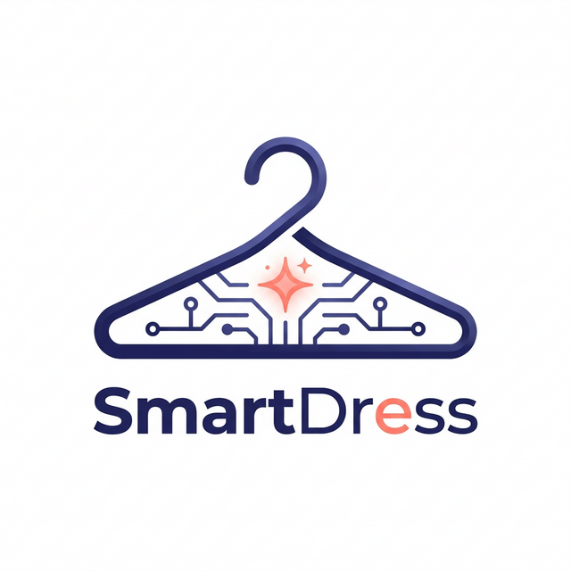

# Charte Graphique : SmartDress

> **Identité** : Moderne, Amicale, Intelligente.

## 🎨 Palette de Couleurs (HSL)

| Rôle | Nom | Valeur HSL | Hex (approx) | Usage |
| :--- | :--- | :--- | :--- | :--- |
| **Primary** | Indigo-500 | `hsl(230, 60%, 50%)` | `#3b4cc0` | Marque, Boutons CTA, Navigation |
| **Primary** | Indigo-700 | `hsl(230, 60%, 35%)` | `#222f8a` | Hover, Titres foncés |
| **Accent** | Coral-500 | `hsl(15, 80%, 65%)` | `#f58e57` | Notifications, Points d'intérêt |
| **Neutral** | Slate-900 | `hsl(220, 15%, 10%)` | `#17191e` | Texte principal |
| **Neutral** | Slate-100 | `hsl(220, 15%, 95%)` | `#f1f2f4` | Background clair |
| **Success** | Emerald-500 | `hsl(150, 60%, 45%)` | `#2ecc71` | Tenue validée |
| **Error** | Rose-500 | `hsl(350, 70%, 55%)` | `#f84c6b` | Alertes, Suppression |

---

## 🔡 Typographie

- **Titres (Heading)** : `Outfit` (Sans-serif géométrique, moderne)
- **Corps (Body)** : `Inter` (Optimisé pour la lisibilité mobile)

---

## 📐 Bordures & Ombres

- **Radius** : `0.75rem` (xl) - Arrondi doux pour l'aspect amical.
- **Shadow** : `shadow-md` (Standard) et `shadow-lg` (Hover/Floating FAB).

---

## 🖼️ Logo Officiel

