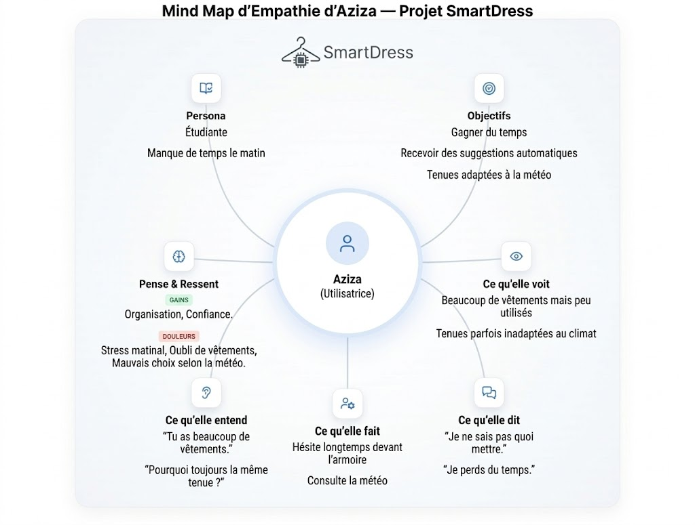
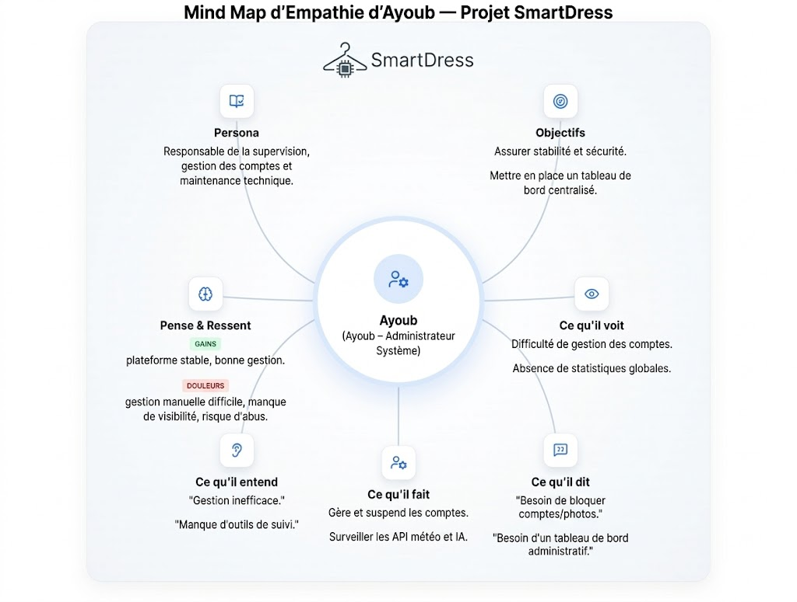

  
  

# **Projet de Fin de Formation**
### **SmartDress : Développement d’une Solution intelligente pour la recommandation et la gestion de garde-robe digitale**

**Réalisée par :** Yasmine Haddad  
**Encadré par :** M. ESSARRAJ Fouad  
**Filière :** Développement Mobile 

---

## Sommaire

  

1

Contexte du projet

  

2

Méthodologie de travail

  

3

Branche Fonctionnelle

  

4

Branche Technique

  

5

Conception

    

6

Démonstration

  

7

Conclusion

---
## 1. Contexte du projet
**Dans le cadre de ma formation en développement web, nous devons réaliser un projet de fin d’études répondant à un besoin réel. En observant les difficultés liées au choix des tenues, j’ai constaté que beaucoup de personnes perdent du temps chaque matin à décider quoi porter.**
**Cette situation a inspiré le projet SmartDress, une application web qui permet d’organiser sa garde-robe digitalement et de recevoir des suggestions de tenues adaptées afin de gagner du temps au quotidien.**

---

## 2. Méthodologie : Design Thinking

  

---

## Méthodologie : Scrum (Agile)

  

---

## 3. Branche Fonctionnelle : Design Thinking
### 1. EMPATHIE

  

  <h3>Carte d'empathie apprenant</h3>
  

---

## Branche Fonctionnelle : Design Thinking
### 1. EMPATHIE

  

  <h3>Carte d'empathie admin</h3>
  

---

## Branche Fonctionnelle : Design Thinking
### 2. DÉFINITION

  

    <h4>Cadrage du problème</h4>
    <blockquote style="font-style: italic; background: white; padding: 15px; border-radius: 8px;">
      
Comment pourrions-nous aider les utilisateurs à mieux organiser leur garde-robe ?

      
Comment pourrions-nous automatiser la suggestion de tenues quotidiennes ?

      
Comment pourrions-nous réduire le temps passé à choisir ses vêtements chaque matin ?

    </blockquote>
    .
  

---

## Branche Fonctionnelle : Design Thinking
### 3. IDÉATION

  

    <h4>Solutions retenues</h4>
    <ul>
      <li>Plateforme web de gestion de garde-robe digitale.</li>
      <li>Ajout et catégorisation des vêtements avec photos.</li>
      <li>Génération de suggestions de tenues personnalisées.</li>
      <li>Calendrier de planification des tenues hebdomadaires.</li>
    </ul>
  

---

## Branche Fonctionnelle : Cas d'utilisation

  

---

## Branche Fonctionnelle : Cas d'utilisation - Sprint 1

  

---

## Branche Fonctionnelle : Cas d'utilisation - Sprint 2

  

---

## Branche Fonctionnelle : Maquettes (UI/UX)

  

   
  

---

## 4. Branche Technique : Tech Stack

  

    <h4>Les technologies à utiliser</h4>
    <ul>
      <li><strong>Base de données:</strong> MySQL </li>
      <li><strong>Framework:</strong> Laravel 12</li>
      <li><strong>Architecture:</strong> N-Tiers</li>
      <strong>Controller:</strong> Requêtes HTTP 
      <strong>Service:</strong> Logique métier 
      <strong>Model:</strong> Base de données
      <li><strong>Architecture:</strong> MVC</li>
      <li><strong> Blade :</strong>Templates réutilisables (components, layouts).</li>
    </ul>
  

  

    <ul>
      <li><strong> AJAX :</strong> Interactions dynamiques (ex: Modales) sans rechargement de page.</li>
      <li><strong>Alpine.js :</strong>  Librairie JavaScript pour les interactions dynamiques.</li>
      <li><strong>Spatie :</strong> Librairie pour la gestion des permissions et rôles.</li>
      <li><strong>Vite :</strong>   Outil de build rapide.</li>
      <li><strong>Lucide :</strong> Librairie d'icônes.</li>
      <li><strong>Tailwind CSS :</strong>Développement rapide, responsive.</li>
    </ul>
  

---

## 5. Conception : Diagramme de classe

 <h3>Modélisation des données (MLD)</h3>

 
  

---

## 5. Démonstration : Environnement & Outils

  

    <h4>Environnement de Développement</h4>
    <ul>
      <li><strong>IDE :</strong> VS Code & Antigravity </li>
      <li><strong>Monitoring DB :</strong> Workbench Sql</li>
    </ul>
  

  

    <h4>Gestion & Déploiement</h4>
    <ul>
      <li><strong>Modelisation UML :</strong>Mermaid/PlantUML</li>
      <li><strong>Gestion de version :</strong> Git (GitHub)</li>
      <li><strong>Navigateur :</strong> Chrome DevTools</li>
    </ul>
  

 

---
## 6. Conclusion

### Merci pour votre attention !