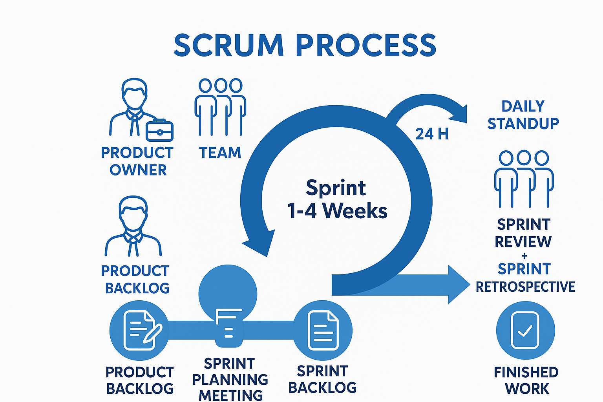
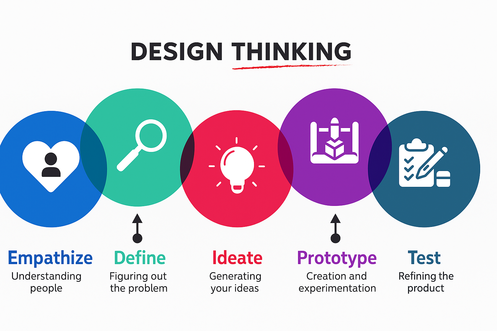
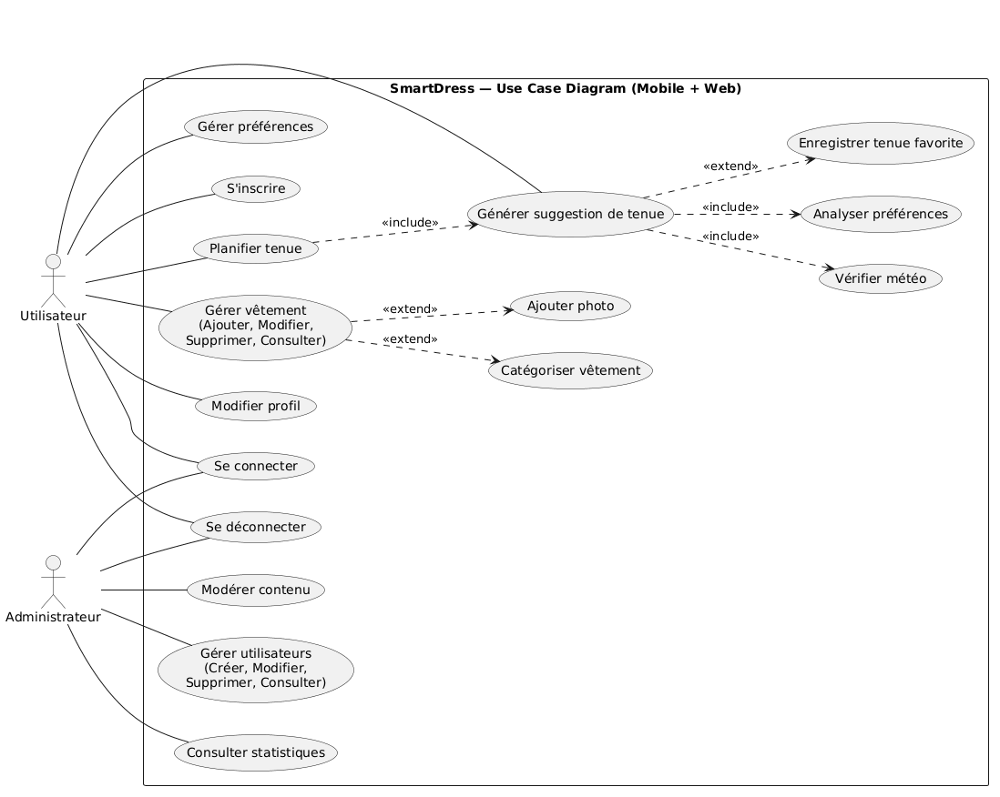
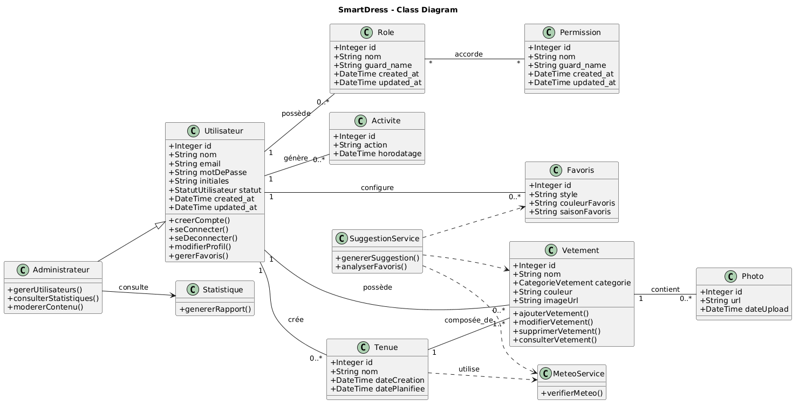
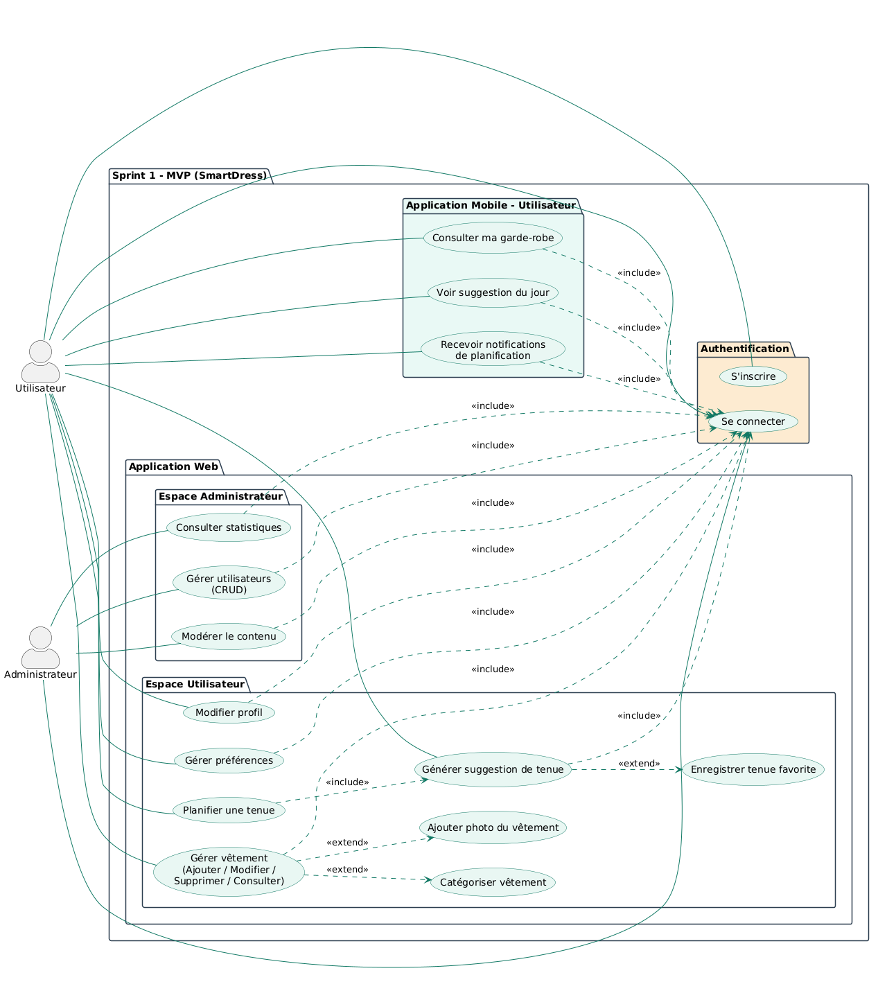
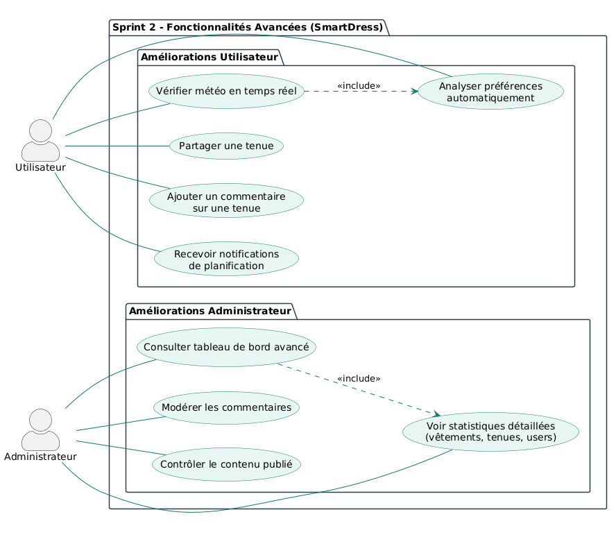

# Rapport de Projet de Fin de Formation  
## SmartDress : Développement d’une Solution intelligente pour la recommandation et la gestion de garde-robe digitale 
### Formation de Développement Mobile – Mode Bootcamp  

---

**Réalisée par :** Yasmine Haddad  
**Encadré par :** Mr. Essarraj Fouad  

**Année de Formation :** 2025/2026

---

# Table des matières

1. [Liste des figures](#liste-des-figures)  
2. [Remerciement](#remerciement)  
3. [Introduction](#introduction)  
4. [Contexte de projet](#contexte-de-projet)  
5. [Objectif de Project](#objectif-de-project)  
6. [Cahier de charge](#cahier-de-charge)  
7. [Méthode de travail](#méthode-de-travail)  
8. [Scrum](#scrum)  
9. [La méthodologie 2TUP](#la-méthodologie-2tup)  
10. [Design Thinking](#design-thinking)  
11. [Branche fonctionnelle](#branche-fonctionnelle)  
12. [Carte d’empathie](#carte-dempathie)  
13. [Définition de problème](#définition-de-problème)  
14. [Diagramme de cas d’utilisation générale](#diagramme-de-cas-dutilisation-générale)  
15. [Diagramme de cas d’utilisation Sprint 1](#diagramme-de-cas-dutilisation-sprint-1)  
16. [Diagramme de cas d’utilisation Sprint 2](#diagramme-de-cas-dutilisation-sprint-2)  
17. [Branche technique](#branche-technique)  
18. [Choix technologiques](#choix-technologiques)  
19. [Architecture de projet](#architecture-de-projet)  
20. [Prototype (Fonctionnalités, Classes)](#prototype-fonctionnalités-classes)  
21. [Conception](#conception)  
22. [Diagramme de classe](#diagramme-de-classe)  
23. [Maquettes](#maquettes)  
24. [Charte graphique](#charte-graphique)  
25. [Réalisation](#réalisation)  
26. [Interfaces](#interfaces)  
27. [Conclusion](#conclusion)  

---

# Liste des figures

. 

---

# Remerciement

Je tiens à exprimer ma profonde gratitude à Monsieur ESSARRAJ Fouad, notre formateur, pour son encadrement précieux, sa disponibilité et ses conseils pertinents tout au long de la réalisation de ce projet. Son expertise, sa rigueur et sa passion pour le développement logiciel ont grandement contribué à enrichir mes compétences techniques et professionnelles. Ce projet n'aurait pas vu le jour sans son accompagnement constant et ses remarques constructives qui m'ont permis de progresser étape par étape. Je remercie également toutes les personnes qui, de près ou de loin, ont apporté leur aide ou leur soutien durant cette aventure.

---

# Introduction

La gestion de la garde-robe et le choix d'une tenue constituent une activité quotidienne essentielle, impactant directement l'organisation et le bien-être de nombreuses personnes. Cependant, beaucoup rencontrent des difficultés à exploiter pleinement leurs vêtements, perdant du temps chaque matin par manque de visibilité sur leurs possessions ou par indécision face aux combinaisons possibles.
Parallèlement, s'adapter aux conditions météorologiques variables et optimiser la rotation des articles rarement portés reste un défi constant. Face à ce constat, le projet **SmartDress** vise à numériser la garde-robe digitale et à automatiser les suggestions de tenues personnalisées, afin de rendre le processus de choix vestimentaire plus simple, fluide et intelligent. 

---

# Contexte de projet

Dans le cadre de ma formation en développement web, nous devons réaliser un projet de fin de formation qui reflète nos compétences et répond à un besoin réel. En observant mon entourage et les difficultés quotidiennes liées au choix des tenues, j’ai constaté que beaucoup de personnes perdaient du temps chaque matin à décider quoi porter, sans toujours tenir compte de la météo ou des combinaisons possibles. Cette situation a inspiré l’idée du projet **SmartDress**, une application web permettant d’organiser sa garde-robe de manière digitale et de recevoir des suggestions de tenues adaptées, afin de simplifier le choix vestimentaire et gagner du temps au quotidien.

---

# Objectif de Project

.

---

# Cahier de charge

## Description :
SmartDress est une application mobile intelligente qui permet aux utilisateurs de gérer leur garde-robe de manière digitale et de recevoir des suggestions de tenues automatiques basées sur la météo et leurs préférences personnelles.

## Objectifs principaux
- Numériser et organiser physiquement la garde-robe via une interface mobile.
- Réduire le temps d'indécision matinale grâce à des suggestions intelligentes.
- Adapter les tenues aux conditions météorologiques réelles.
- Optimiser l'utilisation de tous les vêtements possédés (éviter l'oubli).
- Faciliter une consommation de mode plus responsable et organisée.

## Utilisateurs et rôles
1. **Utilisateur** : Gère sa garde-robe, consulte les suggestions, classe ses vêtements par style et saison.
2. **Admin** : Supervise la plateforme, gère les informations de base, surveille les flux de données et assure le bon fonctionnement du système.

## Fonctionnalités clés
- Création de compte et authentification sécurisée.
- Recherche et filtrage des vêtements par catégorie, style et saison.
- Suivi des suggestions de tenues quotidiennes et historique.
- Gestion complète de la garde-robe digitale (Ajout, Modification, Suppression).
- Tableau de bord et statistiques d'utilisation (pour l'administrateur).
- Notifications quotidiennes pour les tenues et alertes météo.

## Contraintes
- Interface mobile intuitive et esthétique.
- Rapidité des algorithmes de recommandation.
- Sécurité et confidentialité des données utilisateurs.
- Accessibilité et ergonomie.

## Critères de réussite
- Fluidité de la numérisation des vêtements.
- Pertinence des recommandations par rapport à la météo.
- Réduction du temps passé par l'utilisateur à choisir sa tenue.
- Stabilité technique (disponibilité des API externes).
- Satisfaction globale des utilisateurs lors des phases de test.

---

# Méthode de travail

---

# Scrum

La méthodologie Scrum est une méthodologie agile qui permet de gérer un projet de manière flexible et collaborative, en favorisant la livraison progressive de fonctionnalités. Elle repose sur l’itération, la priorisation des tâches et la communication régulière entre les membres de l’équipe.  

Dans le cadre de ce projet, nous avons organisé le travail selon les principes de Scrum, ce qui nous a permis de mieux planifier, suivre et livrer les différentes fonctionnalités de l'application de manière efficace.  

## Principes clés

- **Transparence :** Toutes les tâches et objectifs sont visibles par l’équipe.  
- **Inspection :** Chaque sprint est évalué pour détecter les améliorations possibles.  
- **Adaptation :** L’équipe ajuste le plan de travail selon les résultats des sprints précédents.  

---

# Design Thinking

 

## Qu’est-ce que le Design Thinking ?
Le **Design Thinking** est une approche de résolution de problèmes centrée sur l’humain.
Elle vise à comprendre les besoins réels des utilisateurs pour créer des solutions innovantes.
Très utilisée dans le design, la technologie, l’éducation, l’innovation et les services.
## Pourquoi utiliser le Design Thinking ?
- Encourage la créativité et l’innovation
- Permet de développer des solutions réellement adaptées aux besoins des utilisateurs
- Favorise la collaboration entre équipes
- Utile pour résoudre des problèmes complexes ou mal définis
## Les 5 étapes du Design Thinking
1. **Empathie (Empathize)**:
Comprendre l’utilisateur : observer, interviewer, analyser
Objectif : découvrir ses besoins, ses motivations et ses difficultés
2. **Définition du problème (Define)**:
Regrouper et analyser les informations collectées
Formuler un problème clair et centré sur l’utilisateur
Exemple : « Comment pourrions-nous aider l’utilisateur à… ? »
3. **Idéation (Ideate)**:
-Générer un maximum d’idées sans jugement
-Utiliser des techniques comme le brainstorming, le mind mapping, ou les questions « Comment pourrions-nous ? »
-Encourager la créativité et les points de vue variés
4. **Prototype**:
- Créer des versions simplifiées ou maquettes des idées sélectionnées
- Peut être un dessin, un modèle, une interface simple, un scénario, etc.
- Objectif : expérimenter rapidement
5. **Test**:
- Tester les prototypes auprès des utilisateurs
- Recueillir leurs commentaires
- Améliorer, ajuster ou repenser la solution

---

# Branche fonctionnelle

## Carte d'empathie
La carte d’empathie est un outil utilisé pour mieux comprendre les besoins, les attentes et les difficultés des différents utilisateurs du système. Dans le cadre du projet SmartDress, deux cartes d’empathie ont été réalisées pour les profils principaux de la plateforme : l’utilisateur et l’administrateur. Ces cartes permettent d’identifier ce que chaque utilisateur pense, ressent, voit et fait, afin de concevoir une solution qui répond au mieux à leurs besoins. Les figures suivantes présentent les différentes cartes.

**Utilisateur :**

 

**Administrateur :**

 

---

# Définition de problème

# Définition du Problème – SmartDress

Même si les personnes disposent de nombreux vêtements dans leur garde-robe, plusieurs difficultés rendent le choix des tenues quotidiennement compliqué. L’analyse met en évidence les problèmes suivants :

Difficulté à choisir une tenue : Beaucoup de personnes hésitent chaque matin sur quoi porter, ce qui entraîne une perte de temps et du stress, surtout avant le travail ou les études.

Mauvaise organisation de la garde-robe : Les vêtements ne sont pas toujours classés ou visualisés clairement, ce qui empêche de savoir exactement ce que l’on possède.

Manque d’inspiration pour associer les vêtements : Certaines personnes ont du mal à créer des combinaisons harmonieuses entre hauts, bas et chaussures.

Non prise en compte de la météo : Les choix vestimentaires ne sont pas toujours adaptés aux conditions climatiques (chaleur, froid, pluie), ce qui peut entraîner un inconfort durant la journée.

Perte de temps quotidienne : Le temps passé à réfléchir à une tenue peut devenir répétitif et inefficace.

---

# Diagramme de cas d’utilisation générale

Le diagramme de cas d’utilisation de SmartDress présente les principales fonctionnalités accessibles aux deux acteurs du système : l’utilisateur et l’administrateur. L’utilisateur peut s’inscrire, se connecter, gérer ses vêtements, ajouter des photos, organiser ses articles, gérer ses préférences et recevoir des suggestions de tenues selon la météo, avec la possibilité d’enregistrer des tenues favorites. L’administrateur, quant à lui, peut gérer les utilisateurs, modérer le contenu et consulter les statistiques. Ce diagramme permet de visualiser les interactions entre les acteurs et le système avant le développement.

---
# Diagramme de cas d’utilisation globale

Le diagramme de cas d’utilisation de SmartDress présente les principales fonctionnalités accessibles aux deux acteurs du système : l’utilisateur et l’administrateur. L’utilisateur peut s’inscrire, se connecter, gérer ses vêtements, ajouter des photos, organiser ses articles, gérer ses préférences et recevoir des suggestions de tenues selon la météo, avec la possibilité d’enregistrer des tenues favorites. L’administrateur, quant à lui, peut gérer les utilisateurs, modérer le contenu et consulter les statistiques. Ce diagramme permet de visualiser les interactions entre les acteurs et le système avant le développement.

---

# Diagramme de cas d’utilisation Sprint 1
- Le premier sprint correspond au MVP de l’application SmartDress.
- Il permet à l’utilisateur de se connecter, consulter sa garde-robe, gérer ses vêtements et préférences, planifier une tenue et recevoir des suggestions de tenues.
- L’administrateur peut gérer les utilisateurs, modérer le contenu et consulter les statistiques.

---

# Diagramme de cas d’utilisation Sprint 2
- Ce deuxième sprint ajoute des fonctionnalités avancées à SmartDress.

- L’utilisateur peut mieux gérer ses vêtements, ses préférences et enregistrer des tenues favorites, tandis que l’administrateur peut suivre l’activité et gérer les utilisateurs.

- Ce sprint permet ainsi d’améliorer l’expérience globale de l’application et d’optimiser la gestion de la garde-robe intelligente.

---

# Branche technique
Dans ce projet, plusieurs technologies ont été choisies pour assurer **performance, maintenabilité, sécurité et rapidité de développement**.

---

## 🔹 Technologies Backend

### PHP 8+
Langage utilisé par Laravel, simple à apprendre, stable et largement supporté pour les applications web.

### Laravel 12
Framework backend basé sur le modèle **MVC**, qui apporte une structure claire à l’application.  
Il facilite la gestion du **CRUD**, de l’**authentification**, des **middlewares** et améliore la **sécurité** globale du système.

### Eloquent ORM
Permet de gérer la base de données en utilisant des **modèles orientés objet** plutôt que des requêtes SQL manuelles.

### Spatie Laravel Permission
Package Laravel permettant de gérer les **rôles et permissions** (admin, éditeur, visiteur) de manière professionnelle et intégrée au système de **middleware**.

---

## 🔹 Technologies Frontend

### Blade Templates
Moteur de templates de Laravel permettant de créer des **pages dynamiques** avec des **layouts réutilisables**.

### Tailwind CSS
Framework CSS basé sur les **classes utilitaires** qui facilite la création d’un **design moderne, propre et rapide**.

### JavaScript + jQuery
JavaScript est utilisé pour les interactions côté client.  
jQuery peut être utilisé en complément pour **simplifier certaines manipulations du DOM** ou les **requêtes AJAX**.

### Preline
Bibliothèque basée sur **Tailwind CSS** qui fournit des **composants UI prêts à l’emploi** (modals, menus, dropdowns, etc.) avec des interactions déjà intégrées, permettant de créer rapidement des interfaces modernes.

🔗 https://preline.co/

### Vite
Vite est l’outil de **build moderne utilisé par défaut par Laravel** pour compiler les ressources frontend.

Il offre :

- un environnement de développement très rapide
- le **Hot Module Replacement (HMR)** pour un rechargement instantané
- une compilation optimisée pour la production
- une gestion simplifiée des **assets (CSS, JavaScript, images)**

Il s’intègre parfaitement avec **Blade, Tailwind CSS et les frameworks JavaScript modernes**.

---
## 🔹 Outils externes

## Tiptap (éditeur de texte)

Tiptap est un **éditeur de texte moderne et hautement personnalisable** basé sur **ProseMirror**.

Il permet d’intégrer facilement un **éditeur WYSIWYG avancé** dans l’application, offrant plusieurs fonctionnalités :

- mise en forme du texte
- insertion d’images
- listes
- citations
- extensions via plugins

Grâce à sa structure **flexible et modulaire**, Tiptap permet d’adapter l’expérience d’édition aux besoins spécifiques du projet tout en conservant une **interface intuitive pour l’utilisateur**.

---

## Architecture du projet

Le projet SmartDress repose sur une architecture cohérente qui combine **trois niveaux d’organisation** :

- Architecture **MVC**
- Architecture **en couches (3-tiers / N-tiers)**
- Architecture **globale du système**

Cette structure garantit :

- une **bonne séparation des responsabilités**
- une **maintenance facilitée**
- une **évolution future du système**

---

### 1. Architecture MVC

L’application web est développée en suivant le modèle **MVC (Model - View - Controller)** fourni par le framework Laravel.

Ce modèle organise le code en trois parties :

#### Modèle (Model)

Représente les **données du système** :

- User
- Vêtement
- Tenue
- Favori

Les modèles :

- gèrent les **relations entre les entités**
- assurent l’accès à la base de données via **Eloquent ORM**

#### Vue (View)

Interface utilisateur construite avec :

- Blade Templates
- HTML5
- Tailwind CSS
- JavaScript / jQuery

Les vues permettent d’afficher :

- la liste des **vêtements**
- les **détails des tenues**
- le **formulaire One-Page** (ajout / modification)

### Contrôleur (Controller)

Les contrôleurs jouent le rôle **d’intermédiaire entre l’utilisateur et le système**.

Ils permettent de :

- gérer les **requêtes HTTP**
- appliquer la **logique métier**
- effectuer la **validation des données**
- renvoyer les **données aux vues ou à l’API**

Cette architecture MVC permet d’avoir une application **structurée, claire et facile à maintenir**.

---

## 2. Architecture 3-tiers

En plus du MVC, le projet implémente une **architecture en couches (3-tiers)** qui sépare les responsabilités techniques.

### a. Couche Présentation

Elle correspond à la **partie visible par l’utilisateur**.

Elle comprend :

- pages de l'application
- affichage des suggestions
- formulaires One-Page
- partie publique de l’application

Technologies utilisées :

- Blade
- HTML5
- Tailwind CSS
- JavaScript
- jQuery

Communication avec le backend via **HTTP ou AJAX**.

---

### b. Couche Logique Métier

Cette couche gère :

- la **validation**
- les **règles métier**
- la gestion des **vêtements**
- la gestion des **utilisateurs**
- la gestion des **catégories**

Elle est implémentée dans :

- les **Controllers**
- éventuellement des **Services Laravel**

Elle intègre également la gestion de **sécurité et des permissions** via **Spatie Laravel Permission**, permettant de contrôler l’accès aux différentes fonctionnalités.

---

### c. Couche Accès aux Données

Cette couche est responsable de la **gestion des données**.

Elle comprend :

- les **modèles Eloquent**  
  (User, Vêtement, Tenue, Favori…)

Responsabilités :

- gestion des **relations entre entités**
- exécution des **requêtes SQL**
- gestion de la **sécurité et de l’intégrité des données**

Interaction directe avec la **base de données MySQL**.

---

## 3. Architecture globale

L’architecture globale du projet est une **combinaison entre l’architecture MVC et l’architecture 3-tiers**.

### Couche Présentation
Inclut :

- les **Vues Blade**
- les **Controllers**

Ces éléments gèrent :

- l’interaction avec l’utilisateur
- les requêtes HTTP

### Couche Logique Métier
Regroupe :

- les **Services**
- la **validation**
- la gestion des **rôles et permissions** via Spatie

### Couche Accès aux Données
Contient :

- les **modèles Eloquent**
- la **base de données MySQL**

Elle est responsable du **stockage et de la récupération des informations**.

---

Cette organisation permet d’avoir une application :

- **modulaire**
- **sécurisée**
- **facile à maintenir**
- capable de communiquer aussi bien avec une **application web** qu’une **application mobile**.
---

# Conception : Diagramme de classe
**Le diagramme de classes représente la structure interne de l’application SmartDress et illustre les différentes entités du système ainsi que les relations entre elles. Il met en évidence les classes principales telles que Utilisateur et Administrateur, qui représentent les différents acteurs de la plateforme.**

- Le diagramme de classes présente la structure interne de l’application SmartDress et les relations entre ses différentes entités. Il met en évidence les classes principales telles que Utilisateur et Administrateur, qui représentent les acteurs de la plateforme.

- Les utilisateurs peuvent ajouter des vêtements, tandis que le système génère des suggestions de tenues. Les utilisateurs peuvent consulter les vêtements, créer des tenues et suivre leurs préférences. Le système inclut également des fonctionnalités comme les favoris et les notifications, ainsi qu’un mécanisme de gestion des rôles et des permissions pour contrôler les accès.

**Cette représentation permet de mieux comprendre la logique métier de l’application avant son implémentation.**

# Maquettes

**Maquette web**

**Maquette mobile**

---

# Charte graphique

La charte graphique de SmartDress est conçue pour refléter une identité moderne, élégante et axée sur la mode. Elle s'inspire de teintes naturelles pour offrir une expérience utilisateur premium.

## 1. Palette de Couleurs

La palette SmartDress est inspirée des matières naturelles et organiques. Elle transmet une identité **chaleureuse, professionnelle et raffinée**.

| Rôle | Nom | Code HEX | Usage Principal |
| :--- | :--- | :--- | :--- |
| **Primaire** | Moss Green | `#889063` | Boutons CTA, tags, accents, icônes actives |
| **Contraste** | Bark Brown | `#5C4A35` | Textes principaux, header sombre, footer |
| **Secondaire** | Tan | `#CFBB99` | Hover states, badges, éléments décoratifs |
| **Fond** | Bone | `#E5D7C4` | Sections alternées, fonds de cartes |
| **Fond** | Cream | `#F5EEE4` | Cartes, inputs, zones claires |
| **Accent** | Deep Tan | `#B8A07E` | Détails graphiques, accents doux |
| **Base** | Off-White | `#FDFAF6` | Fond de page principale |

## 2. Typographie

SmartDress utilise un système de deux polices complémentaires : une police d'affichage élégante pour les titres, et une police de corps lisible pour le contenu.

### Polices Utilisées
- **Cormorant Garamond (Serif)** : Utilisée pour les titres (Hero, H1, H2) et les citations. Elle apporte une touche classique et élégante.
- **DM Sans (Sans-Serif)** : Utilisée pour le corps du texte, la navigation, les boutons et les labels. Elle garantit une lisibilité optimale sur tous les supports.

### Échelle Typographique
- **Titres Principaux** : Cormorant Garamond (Light 300)
- **Titres de Section** : Cormorant Garamond (Light 300 / SemiBold 600)
- **Texte de Corps** : DM Sans (Regular 400, 14px)
- **Labels** : DM Sans (Medium 500, UPPERCASE)

## 3. Iconographie

SmartDress utilise des **icônes émoji natives** pour une simplicité visuelle et une performance accrue (aucune bibliothèque externe lourde).

- 👗 : Garde-robe / Vêtements
- 🌤️ : Météo / Conditions climatiques
- ✨ : Suggestion IA / Mise en avant
- 🔔 : Notification / Alerte
- 📊 : Statistiques / Tableau de bord

## 4. Composants UI (Design System)

### Boutons
- **Primaire (sd-btn-primary)** : Fond Moss Green, texte Off-White, uppercase, lettre espacée.
- **Ghost (sd-btn-ghost)** : Fond transparent, bordure Bark Brown, texte Bark Brown.
- **Sombre** : Fond Bark Brown, texte Cream (utilisé pour les actions secondaires ou navbar).

### Éléments de Formulaire
- Les champs de saisie (Inputs) utilisent un fond **Cream** avec une bordure **Bone**. Au focus, la bordure passe au **Moss Green**.

### Border Radius (Rayons de Bordure)
- **Boutons & Inputs** : 2px (Style angulaire et moderne)
- **Badges** : 4px
- **Cartes Témoignages** : 12px
- **Mockups Téléphone** : 38px

## 5. Le Logo

Le logo SmartDress est un logotype typographique :
- **Smart** : Cormorant Garamond, Regular 400, Bark Brown (`#5C4A35`).
- **Dress** : Cormorant Garamond, SemiBold 600 Italic, Moss Green (`#889063`).

---

---

# Réalisation

.

---

# Conclusion

.
