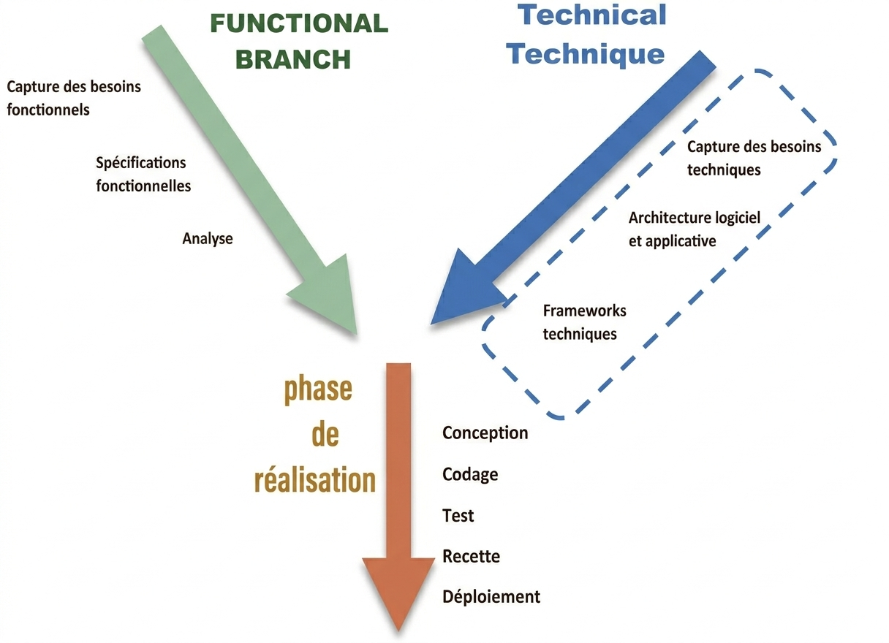

# Rapport de Projet de Fin de Formation  
## SmartDress : Développement d’une Solution intelligente pour la recommandation et la gestion de garde-robe digitale 
### Formation de Développement Mobile – Mode Bootcamp  

---

**Réalisée par :** Yasmine Haddad  
**Encadré par :** Mr. Essarraj Fouad  

**Année de Formation :** 2025/2026

---

# Table des matières

1. [Liste des figures](#liste-des-figures)  
2. [Remerciement](#remerciement)  
3. [Introduction](#introduction)  
4. [Contexte de projet](#contexte-de-projet)  
5. [Objectif de Project](#objectif-de-project)  
6. [Cahier de charge](#cahier-de-charge)  
7. [Méthode de travail](#méthode-de-travail)  
8. [Scrum](#scrum)  
9. [La méthodologie 2TUP](#la-méthodologie-2tup)  
10. [Design Thinking](#design-thinking)  
11. [Branche fonctionnelle](#branche-fonctionnelle)  
12. [Carte d’empathie](#carte-dempathie)  
13. [Définition de problème](#définition-de-problème)  
14. [Diagramme de cas d’utilisation générale](#diagramme-de-cas-dutilisation-générale)  
15. [Diagramme de cas d’utilisation Sprint 1](#diagramme-de-cas-dutilisation-sprint-1)  
16. [Diagramme de cas d’utilisation Sprint 2](#diagramme-de-cas-dutilisation-sprint-2)  
17. [Branche technique](#branche-technique)  
18. [Choix technologiques](#choix-technologiques)  
19. [Architecture de projet](#architecture-de-projet)  
20. [Prototype (Fonctionnalités, Classes)](#prototype-fonctionnalités-classes)  
21. [Conception](#conception)  
22. [Diagramme de classe](#diagramme-de-classe)  
23. [Maquettes](#maquettes)  
24. [Charte graphique](#charte-graphique)  
25. [Réalisation](#réalisation)  
26. [Interfaces](#interfaces)  
27. [Conclusion](#conclusion)  

---

# Liste des figures

. 

---

# Remerciement

.  

---

# Introduction

La recherche de stage constitue une étape essentielle dans le parcours des étudiants en formation supérieure, permettant de mettre en pratique les compétences acquises et de préparer l’insertion professionnelle. Cependant, de nombreux étudiants rencontrent des difficultés pour trouver des stages adaptés à leur profil, en raison de la dispersion des offres, d’informations souvent incomplètes et d’un suivi des candidatures complexe.
De leur côté, les entreprises éprouvent des difficultés à gérer efficacement les candidatures et à identifier rapidement les profils correspondant à leurs besoins. Face à ce constat, le projet **StageFlow** vise à centraliser les offres de stages et à faciliter la mise en relation entre étudiants et entreprises, afin de rendre le processus de recherche et de gestion des stages plus simple, clair et efficace. 

---

# Contexte de projet

Dans le cadre de ma formation en développement web, nous devons réaliser un projet de fin de formation qui reflète nos compétences et répond à un besoin réel. En observant mon entourage et les difficultés quotidiennes liées au choix des tenues, j’ai constaté que beaucoup de personnes perdaient du temps chaque matin à décider quoi porter, sans toujours tenir compte de la météo ou des combinaisons possibles. Cette situation a inspiré l’idée du projet **SmartDress**, une application web permettant d’organiser sa garde-robe de manière digitale et de recevoir des suggestions de tenues adaptées, afin de simplifier le choix vestimentaire et gagner du temps au quotidien.

---

# Objectif de Project

.

---

# Cahier de charge

## Description :
SmartDress est une application mobile intelligente qui permet aux utilisateurs de gérer leur garde-robe de manière digitale et de recevoir des suggestions de tenues automatiques basées sur la météo et leurs préférences personnelles.

## Objectifs principaux
- Numériser et organiser physiquement la garde-robe via une interface mobile.
- Réduire le temps d'indécision matinale grâce à des suggestions intelligentes.
- Adapter les tenues aux conditions météorologiques réelles.
- Optimiser l'utilisation de tous les vêtements possédés (éviter l'oubli).
- Faciliter une consommation de mode plus responsable et organisée.

## Utilisateurs et rôles
1. **Etudiant** : Gère sa garde-robe, consulte les suggestions, classe ses vêtements par style.
2. **Admin** : Supervise la plateforme, gère les comptes, surveille les flux de données (météo, IA) et assure la modération du contenu.

## Fonctionnalités clés
- Création de compte et authentification sécurisée.
- Recherche et filtrage des vêtements par catégorie, style et saison.
- Suivi des suggestions de tenues quotidiennes et historique.
- Gestion complète de la garde-robe digitale (Ajout, Modification, Suppression).
- Tableau de bord et statistiques d'utilisation (pour l'administrateur).
- Notifications quotidiennes pour les tenues et alertes météo.

## Contraintes
- Interface mobile intuitive et esthétique.
- Rapidité des algorithmes de recommandation.
- Sécurité et confidentialité des données utilisateurs.
- Accessibilité et ergonomie.

## Critères de réussite
- Fluidité de la numérisation des vêtements.
- Pertinence des recommandations par rapport à la météo.
- Réduction du temps passé par l'utilisateur à choisir sa tenue.
- Stabilité technique (disponibilité des API externes).
- Satisfaction globale des utilisateurs lors des phases de test.

---

# Méthode de travail

---

# Scrum

La méthodologie Scrum est une méthodologie agile qui permet de gérer un projet de manière flexible et collaborative, en favorisant la livraison progressive de fonctionnalités. Elle repose sur l’itération, la priorisation des tâches et la communication régulière entre les membres de l’équipe.  

Dans le cadre de ce projet, nous avons organisé le travail selon les principes de Scrum, ce qui nous a permis de mieux planifier, suivre et livrer les différentes fonctionnalités du blog de manière efficace.  

## Principes clés

- **Transparence :** Toutes les tâches et objectifs sont visibles par l’équipe.  
- **Inspection :** Chaque sprint est évalué pour détecter les améliorations possibles.  
- **Adaptation :** L’équipe ajuste le plan de travail selon les résultats des sprints précédents.  

---

# La méthodologie 2TUP

## Introduction
La méthodologie **2TUP (Two-Tracks Unified Process)** est un processus de développement logiciel qui s’appuie sur une structure en forme de Y. Elle permet de séparer, puis de réunir, deux dimensions essentielles d’un projet :
- **l’analyse fonctionnelle** (ce que doit faire le système)
- **la conception technique** (comment le réaliser)
Cette approche facilite une meilleure organisation du travail et garantit une compréhension claire des besoins avant la phase de développement. Le 2TUP est également **itératif et incrémental**, ce qui permet d’avancer progressivement avec des versions successives du produit.
## Principes clés du 2TUP
La méthode repose sur plusieurs fondements importants :
- **Itératif et incrémental** : le développement se fait par cycles, en ajoutant des fonctionnalités au fur et à mesure.
- **Piloté par les risques** : les éléments les plus critiques sont traités dès le début du projet.
- **Séparation fonctionnel / technique** : cela évite les confusions et permet une meilleure organisation du travail.
- **Architecture solide** : une base technique fiable est élaborée tôt dans le processus.
- **Collaboration continue** : les utilisateurs sont impliqués régulièrement pour valider les besoins.
## La structure en Y
Le 2TUP est représenté par un schéma en Y, qui reflète les trois grandes étapes du processus :
- **1- Phase initiale : Capture des besoins**

Cette phase consiste à comprendre les objectifs du projet, identifier les acteurs, et préciser les exigences globales.
- **2- Branche fonctionnelle (haut du Y)**

 Elle vise à analyser ce que doit faire le système : cas d’usage, processus métier, workflows, scénarios utilisateurs.
- **3- Branche technique (bas du Y)**

 Elle concerne la manière dont la solution sera construite : architecture, technologies, base de données, API, composants techniques.
- **4- Phase de convergence**
 Les deux branches se rejoignent pour lancer le développement, les tests, l’intégration et la livraison.

---

# Design Thinking

 

## Qu’est-ce que le Design Thinking ?
Le **Design Thinking** est une approche de résolution de problèmes centrée sur l’humain.
Elle vise à comprendre les besoins réels des utilisateurs pour créer des solutions innovantes.
Très utilisée dans le design, la technologie, l’éducation, l’innovation et les services.
## Pourquoi utiliser le Design Thinking ?
- Encourage la créativité et l’innovation
- Permet de développer des solutions réellement adaptées aux besoins des utilisateurs
- Favorise la collaboration entre équipes
- Utile pour résoudre des problèmes complexes ou mal définis
## Les 5 étapes du Design Thinking
1. **Empathie (Empathize)**:
Comprendre l’utilisateur : observer, interviewer, analyser
Objectif : découvrir ses besoins, ses motivations et ses difficultés
2. **Définition du problème (Define)**:
Regrouper et analyser les informations collectées
Formuler un problème clair et centré sur l’utilisateur
Exemple : « Comment pourrions-nous aider l’utilisateur à… ? »
3. **Idéation (Ideate)**:
-Générer un maximum d’idées sans jugement
-Utiliser des techniques comme le brainstorming, le mind mapping, ou les questions « Comment pourrions-nous ? »
-Encourager la créativité et les points de vue variés
4. **Prototype**:
- Créer des versions simplifiées ou maquettes des idées sélectionnées
- Peut être un dessin, un modèle, une interface simple, un scénario, etc.
- Objectif : expérimenter rapidement
5. **Test**:
- Tester les prototypes auprès des utilisateurs
- Recueillir leurs commentaires
- Améliorer, ajuster ou repenser la solution

---

# Branche fonctionnelle

## Carte d'empathie
**Apprenant :**

 

**Entreprise :**

 

**Administrateur :**

 

---

# Définition de problème

# Définition du Problème – SmartDress

Même si les personnes disposent de nombreux vêtements dans leur garde-robe, plusieurs difficultés rendent le choix des tenues quotidiennement compliqué. L’analyse met en évidence les problèmes suivants :

Difficulté à choisir une tenue : Beaucoup de personnes hésitent chaque matin sur quoi porter, ce qui entraîne une perte de temps et du stress, surtout avant le travail ou les études.

Mauvaise organisation de la garde-robe : Les vêtements ne sont pas toujours classés ou visualisés clairement, ce qui empêche de savoir exactement ce que l’on possède.

Manque d’inspiration pour associer les vêtements : Certaines personnes ont du mal à créer des combinaisons harmonieuses entre hauts, bas et chaussures.

Non prise en compte de la météo : Les choix vestimentaires ne sont pas toujours adaptés aux conditions climatiques (chaleur, froid, pluie), ce qui peut entraîner un inconfort durant la journée.

Perte de temps quotidienne : Le temps passé à réfléchir à une tenue peut devenir répétitif et inefficace.

---

# Diagramme de cas d’utilisation générale

.

---

# Diagramme de cas d’utilisation Sprint 1
.

---

# Diagramme de cas d’utilisation Sprint 2
.

---

# Branche technique

. 

---

# Choix technologiques

.

---

# Architecture de projet

.

---

# Prototype (Fonctionnalités, Classes)

.

---

# Conception

.

---

# Diagramme de classe

.

---

# Maquettes

.

---

# Charte graphique

.

---

# Réalisation

.

---

# Interfaces

.

---

# Conclusion

.